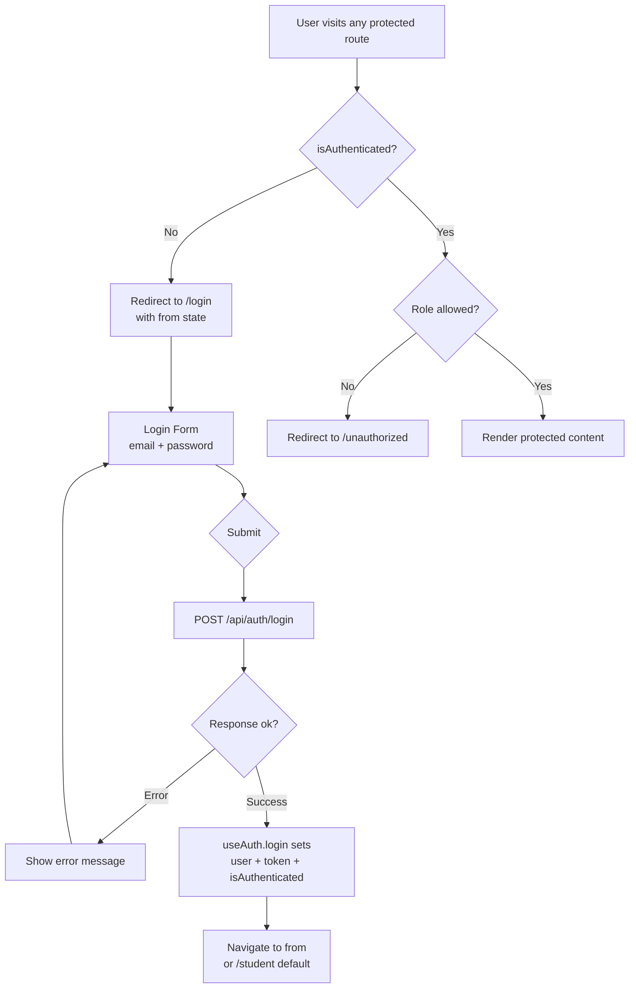
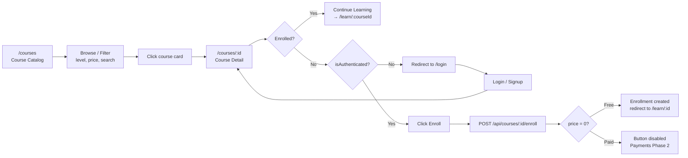
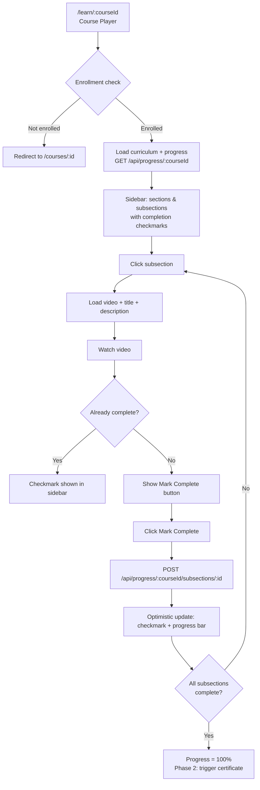
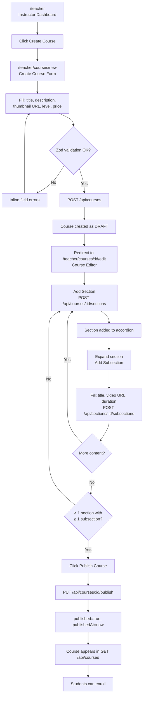
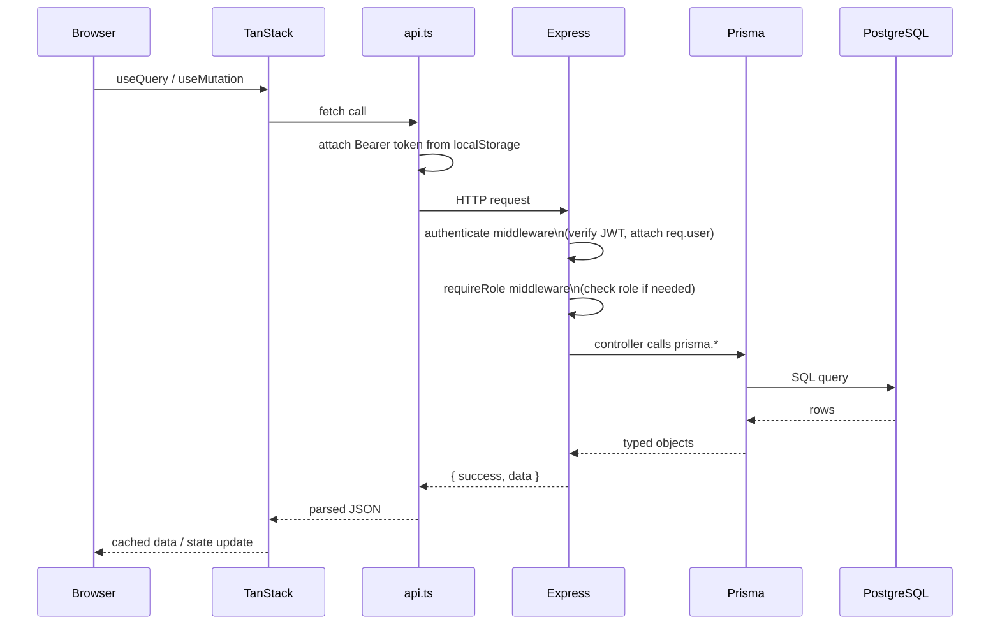
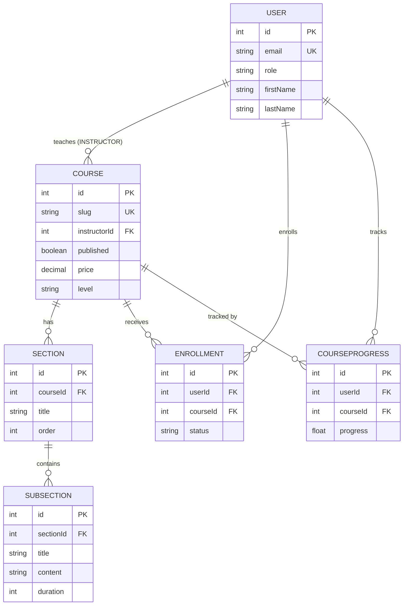
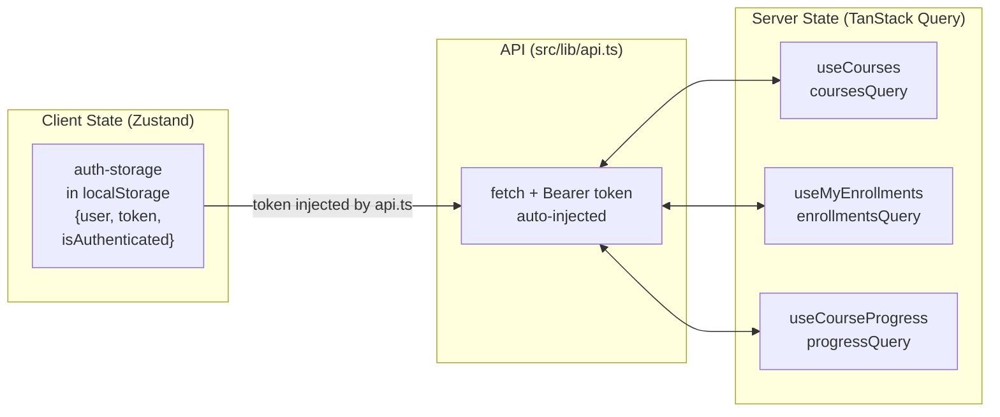

# User Flow Diagrams

Visual flows for every major user journey in the Ed-Tech Platform. These diagrams use Mermaid syntax — rendered natively on GitHub and in most documentation tools.

---

## 1. Authentication Flow

---

## 2. Student — Course Discovery to Enrollment

---

## 3. Student — Learning Loop

---

## 4. Instructor — Course Creation & Publishing

---

## 5. API Request Lifecycle

---

## 6. Data Model Relationships (Core)

---

## 7. State Management

